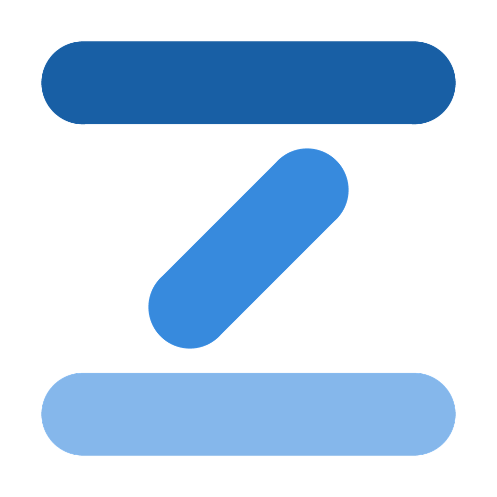

# ZenPhone



*An accessible Android launcher for older adults and people with visual or motor impairments.*

ZenPhone replaces the phone's interface with a larger, simpler and friendlier one. It is free
and open source, and it stands on the shoulders of two earlier projects: the original
[BaldPhone](https://github.com/UriahShaulMandel/BaldPhone) by Uriah Shaul Mandel, and its
modernized continuation [BaldPhone Neo](https://github.com/DamianKuzmiak/BaldPhoneNeo) by
Damian Kuzmiak.

ZenPhone is an independent fork with its own roadmap. It is not affiliated with or endorsed by
the upstream authors.

## Features

- Home launcher with large, high-contrast targets
- Dialer and contacts designed for shaky hands and poor eyesight
- Alarms and medication reminders
- SOS button
- Photo and video viewer
- Simplified keyboard
- Notification management
- Available in 38 languages

## Status

Early stage. The project inherits an in-progress migration from Java to Kotlin — roughly half
the codebase has been converted so far — along with a modernized Android toolchain.

Current priorities:

1. Restore full-screen alarms on Android 14+
2. Raise `targetSdk` to 35, then 36
3. Continuous integration
4. Continue the Kotlin migration

## Building

Requirements: a recent Android Studio (the project uses AGP 9.1.1 and Gradle 9.4.1),
JDK 17 or newer, and Android SDK platforms 35 and 36.

```bash
git clone https://github.com/zenolabs/ZenPhone.git
cd ZenPhone
./gradlew assembleDebug
```

On Windows use `gradlew.bat`, and make sure `JAVA_HOME` points at a JDK 17+ installation —
the runtime bundled with Android Studio, under `<install dir>\jbr`, works fine.

## Installation

No releases yet. Distribution will target F-Droid and direct APK downloads.

Note that Google Play policies restrict apps requesting several system-level permissions at
once (call log, contacts, media). Publishing there would require splitting the app or dropping
core functionality, so it is not currently planned.

## Contributing

Bug reports and pull requests are welcome. For larger changes, please open an issue first so
the approach can be discussed.

Translations are inherited from upstream and cover 38 languages. Improvements to existing
translations are especially welcome.

## License

Apache License 2.0 — see [LICENSE](LICENSE) and [NOTICE](NOTICE).

The `NOTICE` file records the full attribution chain and must be preserved in any
redistribution or derivative work.
